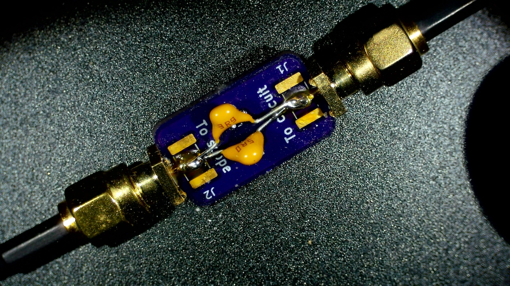

# SMA Oscilloscope Probes

It is pretty common that I am working on a project and I want to leave my 10x probes connected to an electronic circuit project. This can be for 10 minutes while I mess with something in the circuit or it might be for 10 weeks, especially if I am working on the software part of a project, but need to check periodically on the effect on the hardware side.

Leaving conventional scope probes connected is often a problem because they are big and often slip out of place. They're great when you are moving from point to point in the design, but when you want something stable they aren't nearly as good.

Lots of time, I can design in some 50 ohm outputs that can be semi-permanently connected by setting the oscilloscope to 50ohm termination, but then the question is what happens if I disconnect the oscilloscope? Or if my scope doesn't have a 50ohm termination option?

What I really want in these moments is a high impedance 10x probe that has SMA connections instead BNC on one end and a scope probe on the other.

This directory contains two KiCAD designs that allow you to have just that. These circuits are a very conventional 10x divider with capacitors that allow you to tune the compensation on probe for flat response. There is no provision for calibration.

The overall circuit including both parts looks like this:

You can order the boards from OSH Park here:

* [the probe](https://oshpark.com/shared_projects/jtOnijrd)
* [the terminator](https://oshpark.com/shared_projects/2j91MhcF)

# Building the circuit and thoughts for improvements

The circuit diagram above is all fine and good with respect to the capacitance of the input of the 
oscilloscope, but it leaves out the crucial factor of the capacitance of the coax between the two parts of the attenuator. This cable acts like a capacitance because it is short compared to the wavelengths of interest (less than 1m versus 3m). The spec for RG-316 which is commonly used with SMA connectors is 100±5pF / m. In my case, I am interested in is 50cm long so I can expect about 50pF extra. With the 14pF of the scope itself and the 3-10pF of the variable capacitor, that's 66-74pF which needs compensated. This means that we need about 6.5-7.5pF, give or take, instead of 2pF at the probe end. The other effect of this additional capacitance is that the variable capacitor really doesn't have as much bite as we would like so the capacitance at the probe end has to be in a very narrow range. It would be better to use a trimmer with higher capacitance in the next version.

In building the first version of the system, I needed about 8pF on the probe unit to give the trimmer capacitor enough swing to tune the response. With only a single 0805 pad to work with, I removed the SMD capacity from the board and used two disk capacitors. In future versions, I will set up more than one footprint on the board to allow tweaks like this.

One other improvement for future versions is that I would prefer to have two footprints for the resistors since it is easy to get 4.5 MΩ resistors but in larger values, the closest I could get for the divider resistor was 9.1 ΜΩ.

Once you have found an appropriate capacitance, you should be able to use the trimmer to see a waveform like this with a normal calibration signal.

# Parts

This list at Digikey has [all of the passive components](https://www.digikey.com/en/mylists/list/1PMQ8QBF5N) except for the SMA connectors which are a bit expensive from primary parts vendors like Digikey. You can pick these up all over the place for <$1 per connector. See the following items at Amazon, for instance:

* https://www.amazon.com/Superbat-Connectors-Coaxial-Connector-Vertical/dp/B09V6ZY1PH
* https://www.amazon.com/QMseller-Launch-Straight-Connector-Adapter/dp/B07GXSN7VS
* https://www.amazon.com/bnafes-Straight-Connector-Coaxial-Adapter/dp/B09N1RBBFX
  
