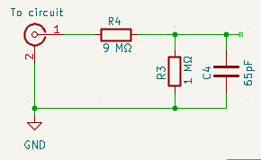
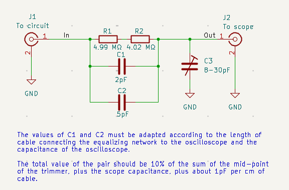
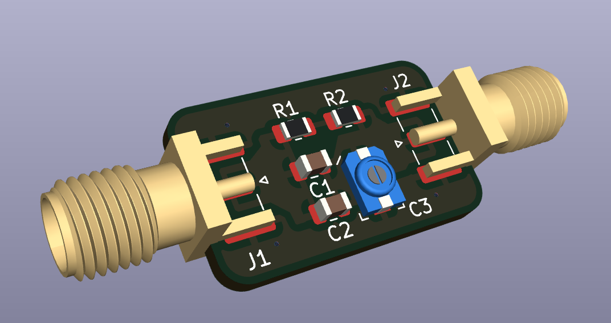

# SMA Oscilloscope Probes

This project has a hardware design with parts ordering links for an oscilloscope probe that terminates in an SMA connector. This is useful when you want a solid, long-lasting connection for making measurements.

# How Oscilloscope Probes Work

A standard 10x oscilloscope works to decrease the impact of oscilloscope on the circuit it is measuring by 
using a 10:1 resistive divider right at the probe tip that increases the impedance and thus the disturbance on the measured circuit.

If, however, you just use a resistive divider, the results are not very good. What happens is that the capacitance 
of the oscilloscope input combined with the capacitance of the cable to the oscilloscope forms a low pass filter
when combined with the resistive divider. Further more, it forms a *very* low pass divider because the capacitance
of the scope is typically about 15pF plus as much as 100pF from the cable and the resistance of the divider is 9MΩ from the probe so we have a time constant of considerably more than 100µ seconds which we can't get more than a few kHz
bandwidth through to measure.

The effective circuit looks like this:

To solve this problem of low bandwidth, the traditional solution is to put a bit of capacitance in parallel with
the first resistor (the 9MΩ one). That causes the impedance of the two resistance+capacitor combinations to be
proportional even to very high frequencies. Looks a bit like this:

Traditionally, there is a variable capacitance added in parallel with the oscilloscope so that the balance between
the two parts of the divider can be set very precisely. That adjustable capacitance is usually put near the 
oscilloscope and the input resistance and corresponding capacitor are put in the oscilloscope probe itself. A big 
reason for that, however, is mechanical and is done to avoid the weight in the probe and to avoid knocking an adjustable
capacitor around so much.

# What's Different Here?

It is pretty common that I am working on a project and I want to leave my 10x probes connected to an electronic circuit project. This can be for 10 minutes while I mess with something in the circuit or it might be for 10 weeks, especially if I am working on the software part of a project, but need to check periodically on the effect on the hardware side.

Leaving conventional scope probes connected is often a problem because they are big and often slip out of place. They're great when you are moving from point to point in the design, but when you want something really stable they aren't nearly as good.

Some times, I can design in some 50 ohm outputs that can be semi-permanently connected by setting the oscilloscope to 50ohm termination, but then the question is what happens if I disconnect the oscilloscope? Or if my scope doesn't have a 50ohm termination option? Or if the circuit won't be happy being loaded so heavily.

What I really want in these moments is a high impedance 10x probe that has an SMA connector instead of a traditional scope probe. Because the weight at the probe end doesn't really matter, we can build all of the compensation and tuning circuitry onto a single small board. That board has the following circuit:

This circuit has two resistors to create the desired 9MΩ because the available thick-film chip resistor values can get 
closer to the desired value this way. Similarly, there are two parallel capacitors so that the different capacitors can be combined to get very close to the required value depending on the length of cable you need and such. This circuit is laid out onto a small (21.5 x 13.0 mm) board with SMA connectors.

This directory contains two KiCAD designs instead of one. The `base` directory contains an old design that put the variable capacitor near the oscilloscope and the `probe` directory contains the current design. This circuit has a very conventional 10x divider with capacitors that allow you to tune the compensation on probe for flat response. There is no provision for calibration, but the specified resistors should be within 1%.

You can order [the board from OSH Park](https://oshpark.com/shared_projects/0noho4Gm).

# Building the Previous Version

The circuit diagram above is all fine and good with respect to the capacitance of the input of the 
oscilloscope, but it leaves out the crucial factor of the capacitance of the coax between the two parts of the attenuator. This cable acts like a capacitance because it is short compared to the wavelengths of interest (less than 1m versus 3m). The spec for RG-316 which is commonly used with SMA connectors is 100±5pF / m. In my case, I am interested in is 50cm long so I can expect about 50pF extra. With the 14pF of the scope itself and the 3-10pF of the variable capacitor, that's 66-74pF which needs compensated. This means that we need about 6.5-7.5pF, give or take, instead of 2pF at the probe end. The other effect of this additional capacitance is that the variable capacitor really doesn't have as much bite as we would like so the capacitance at the probe end has to be in a very narrow range. It would be better to use a trimmer with higher capacitance in the next version.

In building the first version of the system, I needed about 8pF on the probe unit to give the trimmer capacitor enough swing to tune the response. With only a single 0805 pad to work with, I removed the SMD capacity from the board and used two disk capacitors. In future versions, I will set up more than one footprint on the board to allow tweaks like this.

One other improvement for future versions is that I would prefer to have two footprints for the resistors since it is easy to get 4.5 MΩ resistors but in larger values, the closest I could get for the divider resistor was 9.1 ΜΩ.

Once you have found an appropriate capacitance, you should be able to use the trimmer to see a waveform like this with a normal calibration signal.

# Parts

This list at Digikey has [all of the passive components](https://www.digikey.com/en/mylists/list/1PMQ8QBF5N) except for the SMA connectors which are a bit expensive from primary parts vendors like Digikey. You can pick these up all over the place for <$1 per connector. See the following items at Amazon, for instance:

* https://www.amazon.com/Superbat-Connectors-Coaxial-Connector-Vertical/dp/B09V6ZY1PH
* https://www.amazon.com/QMseller-Launch-Straight-Connector-Adapter/dp/B07GXSN7VS
* https://www.amazon.com/bnafes-Straight-Connector-Coaxial-Adapter/dp/B09N1RBBFX
  
